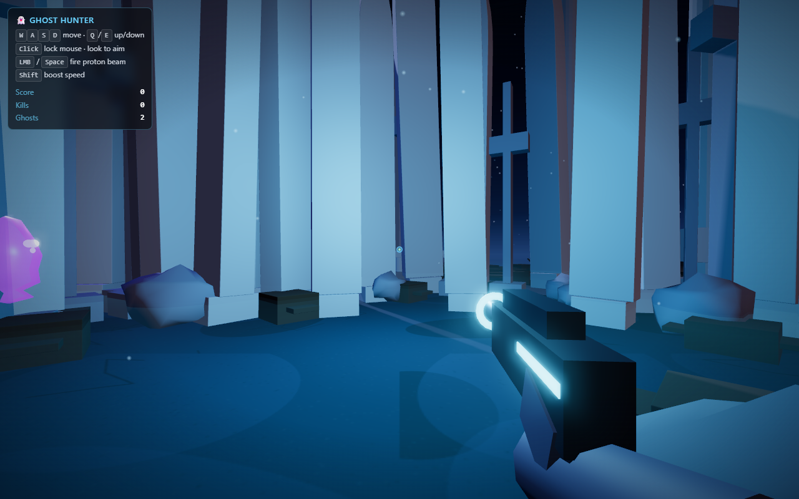
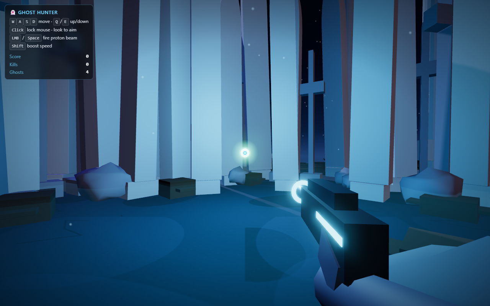
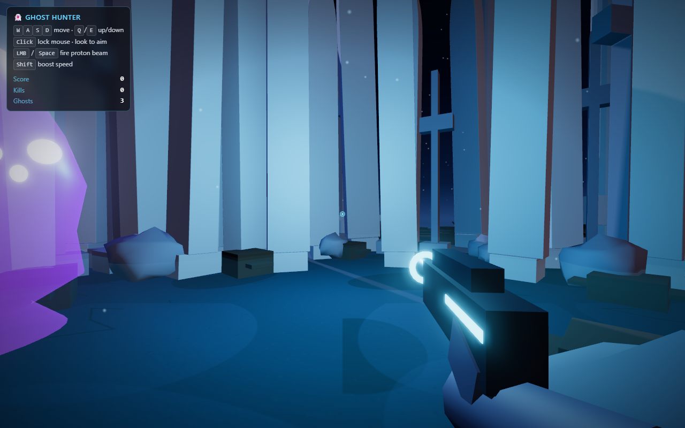

# 👻 Ghost Hunter AR

A first-person ghost-hunting game in the browser — Three.js for rendering,
Rapier for physics, AR.js-ready pipeline, and a graveyard world built from
Blender assets at headless build time.



---

## What it is

You wake up in a moonlit graveyard. Spectral wisps, specters, poltergeists,
and banshees drift toward you out of the fog. Click to lock your mouse, aim
the proton blaster, and fire to vaporize them. Hold Shift to boost, fly free
with WASD/Q/E, and chase the bigger bounties.

The world is built procedurally and from Blender-authored `.glb` assets:
tombstones, crosses, broken pillars, dead trees, a picket fence ring, two
cemetery gates, three mausoleums, and a lathe-spun ghost with glowing eyes.
Post-processing gives the haunting glow.



---

## Features

| | |
|---|---|
| **Rendering** | Three.js r171, ACES Filmic tone mapping, 4× MSAA via `EffectComposer` |
| **Post FX** | `UnrealBloomPass` (threshold 0.72) — ghosts, projectiles, moon bloom |
| **World** | 185 instanced props + 8 unique meshes, 900 stars, drifting mist, dust motes |
| **Ghosts** | Per-type models, oscillating rotation, **spectral fade** up close (see through them) |
| **Combat** | Persistent HP, per-tier scores (wisp 10 → banshee 100), per-projectile trails |
| **Physics** | Rapier WASM init deferred into `await world.init()` so it never silently falls back |
| **Asset pipeline** | `blender/build_assets.py` generates 9 `.blend` files headlessly, `npm run assets:export` produces `.glb` |
| **Resilience** | Procedural fallback geometry for every prop, `webglcontextlost` handler, AR camera passthrough |
| **Performance** | 100 FPS on a desktop GPU with full post FX and shadow-casting props |

---

## Quick start

```bash
npm install
npm run dev                  # http://localhost:5173
```

Then `npm run assets:export` is optional — Blender-generated props in
`public/assets/models/*.glb` are the production visuals, but if Blender
isn't installed the runtime falls back to procedural meshes automatically.

```bash
npm run build                # tsc --noEmit + vite build → dist/
npm test                     # 104 tests
npm run test:coverage        # >93 % lines / >75 % branches / >88 % functions
npm run verify               # structural check + typecheck + tests + build + blender smoke
```

`npm run verify` is the mechanical CI gate. It exits non-zero on any failure.

---

## Controls

| Key | Action |
|---|---|
| **Click** | Lock the mouse for camera aim |
| **Mouse** | Look around |
| **W / A / S / D** | Fly forward / strafe left / back / right |
| **Q / E** | Down / up |
| **Shift** | Boost (×8 speed) |
| **Space** or **LMB** | Fire proton beam (250 ms cooldown) |
| **Escape** | Release the mouse |

The HUD shows Score, Kills, and active Ghost count. A reticle in the centre
sits on top of the proton blaster viewmodel — which itself has a glove and
forearm holding the grip, plus a muzzle flash on every shot.

---

## Screenshots

### The graveyard at spawn

Gravestones and crosses frame the entry vista. The fence ring hugs the
arena. A pair of cemetery gates lead to deeper darkness. The blaster glows
cyan against the moonlight.



### Combat

You can see the ghost's face — glowing eyes and mouth — as a proton bolt
closes in. Bloom catches the ghost's emissive body, the bolt, the muzzle
flash, and the moon simultaneously without washing out the silhouettes.

---

## Architecture

The code is split by **concern**, not by **file size**:

| Folder | Owns |
|---|---|
| `src/core` (→ `src/domain`) | Framework-agnostic: ECS-lite World, value objects, components |
| `src/application/systems` | Use cases (step-physics, move-ghosts, step-projectiles, etc.) |
| `src/composition` | Wiring: `main.ts`, `scene-builder.ts`, `input-manager.ts` |
| `src/adapters` | Concrete: `rapier-physics.adapter.ts`, `fakes/in-memory-physics.world.ts` |
| `blender/` | Headless asset generation (`build_assets.py`) and glTF export (`export.py`) |
| `tests/` | Unit tests for domain + application + adapter |
| `public/assets/models/` | Generated `.glb` files served at runtime |

The game loop is **fixed timestep** (60 Hz for physics, deterministic).
Rendering happens every `requestAnimationFrame` and the camera updates from
the player state every frame — **even before** the pointer is locked.

```
    .blend (assets/source)  ──▶  blender/build_assets.py  ──▶  .blend on disk
                                                          │
                                                          ▼
                                  blender/export.py  ──▶  public/assets/models/*.glb
                                                          │
                                                          ▼
                                  src/composition/scene-builder.ts  (loadGLB, with fallback)
                                                          │
                                                          ▼
                                  InstancedMesh × props  +  cloned ghosts  +  composer.render()
```

---

## Asset pipeline

Nine Blender-generated `.glb` files drive the world:

| Asset | What it is | Used as |
|---|---|---|
| `gravestone` | Arched slab on plinth | ×62 instances |
| `cross` | Christian grave cross | ×22 instances |
| `pillar` | Broken column with capital | ×10 instances |
| `rock` | Jittered icosphere | ×34 instances |
| `tree` | Dead tree (trunk + branches) | ×12 instances |
| `fence` | Two posts + two rails | ×56-segment ring |
| `gate` | Twin pillars + lintel + finials | 2 placements |
| `mausoleum` | Building with pyramidal roof | 3 placements |
| `ghost` | Lathe body + eyes + mouth | cloned per spawn |

```bash
# One-shot regeneration (Blender 5+ required)
blender --background --factory-startup --python blender/build_assets.py

# Then export to .glb
npm run assets:export
```

`run.mjs` auto-discovers Blender at `C:\Program Files\Blender Foundation\Blender X.Y\blender.exe`
on Windows; set `BLENDER_BIN` to override. Exporter skips files whose `.glb`
is newer than the source `.blend`.

---

## The graveyard, in detail

**Sky** — inverted sphere with a vertical canvas gradient (deep navy zenith
→ purple-blue horizon band → dark below). 900 stars with the radial-glow
texture mapped onto `PointsMaterial` so they read as soft circles, not
square pixels. The moon is HDR-pumped (`color.setRGB(1.7, 1.8, 2.1)`) so
it blooms through the post pass.

**Lighting** — ambient + hemisphere + directional moonlight (2 048² shadow
map, PCFSoft) + a warm ember rim light (0xffa864) that breaks the
monochrome blue, plus a cyan and a violet point light for accent.

**Atmosphere** — six mist planes rotating slowly over the ground with the
radial-glow texture; 260 dust motes drifting through the play volume; fog
8 → 34 fades props at the edge of the arena.

**Ghosts** — the Blender ghost is cloned per spawn. Each clone gets a fresh
`MeshStandardMaterial` for the body (per-type color and emissive: wisp 1.0,
specter 1.0, poltergeist 1.0, **banshee 0.7** so it doesn't nuclear-bloom).
The eye/mouth material is shared and `emissive` so the face glows. As a
ghost closes on you, its body and glow fade with distance — see-through at
point-blank, classic spectral behaviour.

**Combat** — Rapier physics initializes after WASM is loaded
(`RAPIER.init()` awaited in `RapierPhysicsWorld.init()`). Projectiles spawn
from the muzzle, fly at 24 u/s, and resolve collisions sphere-vs-sphere
with persistent ghost HP. Score is awarded per ghost type (wisp 10 →
banshee 100).

---

## Why this stack

| Choice | Why |
|---|---|
| **Three.js** | Mature renderer, post-processing pipeline via `examples/jsm`, Y-up scene graph |
| **Rapier (`-compat`)** | WASM physics that loads as base64 in the same JS bundle — no extra Vite plugin |
| **Vite 8** | Fastest dev loop, sane ESM, native TS path resolution |
| **ECS-lite** | Plain JS object bags in a `World` map; small, readable, easy to mock |
| **EffectComposer + UnrealBloomPass** | Cheap, dramatic HDR glow that makes emissive objects sing |
| **InstancedMesh** | 185 draw instances collapse into a handful of draw calls |
| **Blender as build step** | Real geometry, smooth normals, vertex colours — for free |

---

## License

MIT.
